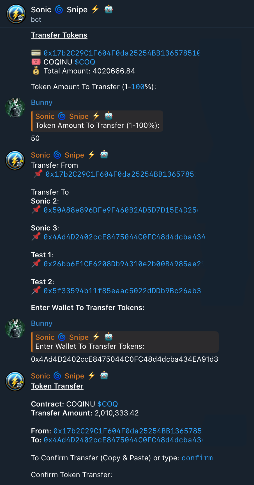

# Contract Management

### Contract Management

Access the Contracts menu through any of the following methods:

* Typing `/contracts` in the chat.
* Selecting **Contracts** from the Single Snipe Menu.
* Choosing **Contracts** on the /wallet Menu.

<figure><figcaption></figcaption></figure>

#### Select Contract

Select a contract for trading using the **Select Contract** option. Sonic Snipe Bot displays a list of available contracts ordered from most recent to least recent. Each contract shows:

* **Total Tokens**: The total number of tokens across all wallets.
* **Total Initial Price**: The cumulative price paid across all wallets.
* **Total Worth**: The current total worth across all wallets.
* **Wallets List**: A list of wallets that have bought the contract.

**Actions:**

* Transfer Tokens: Click 'Transfer' to move tokens between contracts.
* **Select a Contract**: Choose the desired contract by clicking its associated button.
* **Delete a Contract**: Remove a contract by pressing 'Delete' next to its name.
* **Select Wallet**: Prior to selecting a contract, choose the wallet you want to trade from, especially if you hold the same tokens in multiple wallets.

After selecting a contract, the [Single Snipe Menu](https://github.com/SonicSnipeBot/sonicSnipeBot/wiki/Snipe-Menu) will display the selected wallet and contract. To return to the Contracts Menu, click "Contracts".

***

## Transferring Tokens Between Wallets

Detailed guide for transferring tokens between wallets.

We advise exporting Wallet Keys & Transferring Through Metamask or Trust Wallet.\
Please Test Transfer's With Small Amounts before continuing with Large Amounts.

### Steps to Transfer Tokens

1. **Select the Wallet**: Confirm the wallet from which you want to transfer tokens.
2. **Initiate Transfer**: Click the 'Transfer' option next to the token name.
3. **Startup Password**: Enter your startup password if set. Skip this step if no password was configured.
4. **Specify Transfer Amount**: Choose the percentage of tokens to transfer (1-100%).
5. **Recipient Wallet Address**: Input or paste the address of the receiving wallet.
6. **Confirm Transfer**: Complete the transfer by typing or pasting "confirm".

> **Note:** Ensure the compatibility of tokens and wallets. Double-check all transfer details for accuracy.

<figure><figcaption></figcaption></figure>

[Back to Top](contract-management.md#contract-management)

***

### Quick Links

* [Home](../)
* [Getting Started](broken-reference)
* [Single Wallet Snipe](single-wallet-snipe.md)
* [Multi Wallet Snipe](multi-wallet-snipe.md)
* [Snipe New Launches](snipe-new-launches.md)
* [Limit Trading](limit-trading.md)
* [Settings](settings-overview.md)
