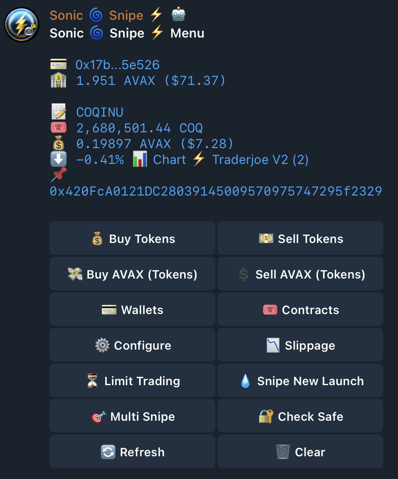

# Single Wallet Snipe

### Snipe Wallet Snipe Menu 

1. [**Access The Snipe Menu**:](single-wallet-snipe.md#access) How to Access The Snipe Menu
2. [**Buy Tokens**](single-wallet-snipe.md#buy-tokens): Buy tokens of the selected contract.
3. [**Sell Tokens**](single-wallet-snipe.md#sell-tokens): Sell tokens of the selected contract.
4. [**Buy (Currency) (Tokens)**](single-wallet-snipe.md#buy-network-currency): Buy a specified amount of tokens in (BNB, ARB, ETH, etc).
5. [**Sell (Currency) (Tokens)**](single-wallet-snipe.md#sell-network-currency): Sell a specified amount of tokens in (BNB, ARB, ETH, etc).
6. [**Select Wallet**](single-wallet-snipe.md#manage-wallets): Add, delete, and switch between different wallets.
7. [**Contracts**](single-wallet-snipe.md#select-contract): Choose a specific contract for trading.
8. [**Configure**](single-wallet-snipe.md#settings): Configure Gas , Gas Limit, Rpc Etc
9. [**Slippage**](single-wallet-snipe.md#slippage): Quick Access Slippage Configure
10. [**Limit Trading**](single-wallet-snipe.md#limit-trading): Monitor Trade, Auto Buy, Auto Sell
11. [**Snipe Liquidity**](single-wallet-snipe.md#snipe-liquidity): Snipe Liquidity
12. [**Multi Snipe**](single-wallet-snipe.md#multi-wallets): Snipe Multiple Wallets at a Time
13. [**Check Safe**](single-wallet-snipe.md#check-safe): Check If the Contract Is Safe To Trade
14. [**Refresh**](single-wallet-snipe.md#refresh): Refresh Snipe Menu (Profits & Loss's)
15. [**Clear**](single-wallet-snipe.md#clear): Clears Selected Wallet for Snipe Menu

<figure><figcaption></figcaption></figure>

### How to Access the Snipe Menu 

To access the Snipe menu, follow these simple steps:

1. **Paste Contract Address or Website Link**: Paste a valid contract address or website link (e.g., Dex Screener, Poocoin, DexTools).
2. **Address Verification**: Sonic will verify the contract address, granting you access to trading actions.
3. **Access the Snipe Menu**:
   * Type `/snipe` in your chat window.
   * Select `/snipe` from the Quick Panel.

Alternatively, you can access the Snipe menu by [Selecting a Contrac](contract-management.md)t through the Select Contract Menu.

[Back to Top](single-wallet-snipe.md#main-menu)

### Buy Tokens 

<figure><figcaption></figcaption></figure>

The **Buy Tokens** option allows you to buy tokens from the selected contract.

When selecting the **Buy Tokens** option, a menu with five options are presented:

1. **Buy 40% Less**: Buy tokens for 40% less than the **default token amount**.
2. **Buy 20% Less**: Buy tokens for 20% less than the **default token amount**.
3. **Buy Default Amount**: Buy tokens for the **default token amount**.
4. **Buy 20% More**: Buy tokens for 20% more than **the default token amount**.
5. **Buy 40% More**: Buy tokens for 40% more than **the default token amount**.
6. **Custom**: Choose a Custom Amount to Buy

Select the option that aligns with the number of tokens you wish to purchase.

You can change the [Default Token Amount](settings-overview.md#default-token-to-buy) from the settings menu.

[Back to Top](single-wallet-snipe.md#main-menu)

### Sell Tokens 

<figure><figcaption></figcaption></figure>

The **Sell Tokens** option allows you to sell tokens of the selected contract for the selected network currency (ETH/BNB/ARB, ETC).

When selecting the **Sell Tokens** option, a menu with four options is presented:

1. **Sell 25%**: Sell 25% of the token balance.
2. **Sell 50%**: Sell 50% of the token balance.
3. **Sell 75%**: Sell 75% of the token balance.
4. **Sell All**: Sell the entire token balance.

Before selling your tokens, Sonic Snipe Bot will attempt to approve the amount of tokens to be sold, If the amount is already approved, the approval step will be skipped saving you Tx Fee. (UniSwap Dex Doesn't Do This)

[Back to Top](single-wallet-snipe.md#main-menu)

### Buy (BNB/ARB/ETH/ETC) (Tokens) 

<figure><figcaption></figcaption></figure>

The **Buy (ETH/BNB/ARB, ETC) (Tokens)** option allows you to buy a specified amount of tokens in BNB, ARB, ETH, etc for the selected contract.

The **Buy Network Currency** menu presents five options:

1. **Buy 25%**: Buy 25% of the **default currency amount**.
2. **Buy 50%**: Buy 50% of the **default currency amount**.
3. **Buy Default Amount**: Buy **default currency amount**.
4. **Buy 150%**: Buy 150% of **default currency amount**.
5. **Buy 200%**: Buy 200% of **default currency amount**.
6. **Custom**: Choose a Custom Amount to Buy

Choose the desired option based on the amount of tokens in BNB, ARB, ETH, etc that you want to buy.

You can Change the [Default Currency Amount](settings-overview.md#default-network-currency-to-buy) from the settings menu.

### Sell (BNB/ARB/ETH/ETC) (Tokens) 

<figure><figcaption></figcaption></figure>

The **Sell (BNB/ARB/ETH) (Tokens)** option allows you to sell a specified amount of tokens in BNB, ARB, ETH, etc for the network currency.

The **Sell Network Currency** menu presents four options:

1. **Sell 25%**: Sell 25% of the network currency balance.
2. **Sell 50%**: Sell 50% of the network currency balance.
3. **Sell 75%**: Sell 75% of the network currency balance.
4. **Sell All**: Sell the entire network currency balance.

Before selling your tokens, Sonic Snipe Bot will attempt to approve the amount of tokens to be sold. If the amount is already approved, the approval step will be skipped.

[Back to Top](single-wallet-snipe.md#main-menu)

### Select Contract 

Quick Access to [Contract Management](contract-management.md)

[Back to Top](single-wallet-snipe.md#main-menu)

### Slippage 

Quick Access to the [Slippage](settings-overview.md#slippage) Menu

[Back to Top](single-wallet-snipe.md#main-menu)

### Limit Trading 

Quick Access to the[ Limit Trading](limit-trading.md) Menu

[Back to Top](single-wallet-snipe.md#main-menu)

### Multi Snipe 

Quick Access to the [Multi Wallet Snipe](multi-wallet-snipe.md) Menu

[Back to Top](single-wallet-snipe.md#main-menu)

### Snipe Liquidity 

Quick Access to the [Snipe Liquidity](snipe-new-launches.md) Menu

[Back to Top](single-wallet-snipe.md#main-menu)

### Select Wallet 

Quick Access to [Wallet Management](wallet-management.md) Menu

[Back to Top](single-wallet-snipe.md#main-menu)

### Check Safe 

The **Check Safe** option shows Information about a contract, collected on the fly across multi Website Api's It Allows you to make a decision whether to Trade a Contract or Not, Its a powerful Tool Provided by Sonic Snipe Bot.\
\
See Also[ Sonic Safe Bot Information](../additional-products/sonic-safe-bot.md)

<figure><figcaption></figcaption></figure>

[Back to Top](single-wallet-snipe.md#main-menu)

### Configure 

Quick Access To[ Settings](settings-overview.md) to Allow You to Modify Gas Limit, Gas, Rpc and any other Settings

[Back to Top](single-wallet-snipe.md#main-menu)

### Refresh 

The **Refresh** option refresh's your token worth in USD, It Also shows wether your in a profit or a loss, +100% -50%. This is Automatically Refreshed every 30 seconds for 12 hours, to 're-activate' it , load /snipe or click Refresh.

### Clear 

This Will Simply Clear Selected Wallet For Snipe Menu.

What this means is /snipe will not Display the Selected Wallet

**Note** Clearing Wallet Will Not Deleted The Contract If it Exists. To Clear Contract Navigate to /contracts.

### Quick Links

* [Home](../)
* [Getting Started](broken-reference)
* [Single Wallet Snipe](single-wallet-snipe.md)
* [Multi Wallet Snipe](multi-wallet-snipe.md)
* [Snipe New Launches](snipe-new-launches.md)
* [Limit Trading](limit-trading.md)
* [Settings](settings-overview.md)
