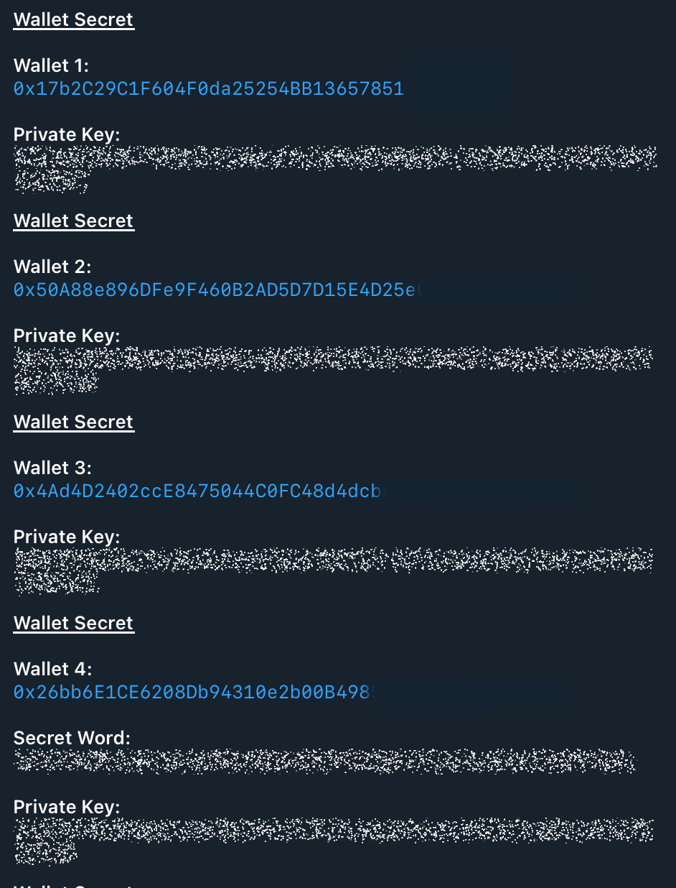

# Wallet Management

### Wallet Management

**Quick Access**

1. [**Wallet Operations**](wallet-management.md#display-wallet-keys): Manage Wallets, Transfer Funds Etc
2. [**Wallet Keys**](wallet-management.md#display-wallet-keys): View your Wallet Keys
3. [**Transfer Crypto Currency Between Wallets**](wallet-management.md#transferring-crypto-currency-between-wallets)**:** Currency Transfer
4. [**Bridge Native Crypto Currency or Tokens Between Networks** ](wallet-management.md#bridge-native-currency-or-tokens-between-networks):  A guide to bridging
5. [**Setting a Password**](wallet-management.md#set-a-password) : Setting a Password

#### You can navigate to the wallets menu by either:

* Typing `/wallets` in the chat.
* Selecting **Select Wallet** in the Sonic Snipe Menu.
* Accessing `/settings` and choosing "Wallets".

<figure><figcaption></figcaption></figure>

### Wallet Operations 

#### Manage Wallets

* **Add Wallet**: To include a new wallet, click **Add Wallet** and comply with the instructions.
* **Delete Wallet**: To remove a wallet, select the wallet you want to delete, click **Delete Wallet**&#x20;
* **Selecting a Wallet**: To switch between wallets, simply choose the desired one from the menu.
* **Rename a Wallet**: To Rename a wallet, Select a Wallet to Rename & click \*\* Rename\*\*.

#### Transfer Funds

To move currency from your selected wallet:

1. Choose your desired wallet in the Wallet Menu (indicated with a ✅).
2. If prompted, enter your password.
3. Provide the recipient's wallet address.
4. Specify the amount to transfer.
5. Confirm the transaction and wait for the transfer's successful completion.

> Encountering issues with gas price or gas limit? Adjust these settings with `/gas` and `/limit`.

### Quick Access

* **Switch Network**: Change your connection to another network by following the guided steps after clicking **Switch Network**.
* **Single Snipe**: Initiate a quick trade with the **Single Snipe** option.
* **Select Contract**: Quickly select a contract by using the **Contract** button.

[Back to Top](wallet-management.md#wallet-management)

***

### Wallet keys 

To view your private keys:

1. Navigate to the settings menu.
2. Select the "My Keys" option.
3. Enter your password that you entered when you configured the snipe bot.

Access quickly by typing `/keys`

**Note:** If you've forgotten your password, you will not have access to the private keys. You have to delete all wallets and re-configure the snipe bot.

**Note:** If you didn't set a password on startup, you will not need to enter a password. It is important to set a password on startup as it protects your Wallet Keys. If someone has access to your telegram accounts, they can easily access your keys if you don't set a password.

<figure><figcaption></figcaption></figure>

[Back to Top](wallet-management.md#wallet-management)

***

## Bridge Native Crypto Currency or Tokens Between Networks

Detailed Guide for Bridging

### Steps to Bridge&#x20;

1. [**Navigate to Wallet Menu**](wallet-management.md#you-can-navigate-to-the-wallets-menu-by-either)**:**&#x20;
2.  **Select the Wallet**: Confirm the wallet from which you want to bridge to (✅) 

    <figure><figcaption></figcaption></figure>
3. **Initiate Bridge**: Click the 'Bridge' option
4.  **Select Network To Bridge:** Choose a network to Bridge to 

    <figure><figcaption></figcaption></figure>
5. **Startup Password**: Enter your startup password if set. Skip this step if no password was configured.
6. **Enter percentage of Token Amount To Bridge:**  \
   **(Note:** Only if native currency of current network not supported, otherwise skip this step)
   1. Make sure you have enough token balance to Bridge
      1. If not, click on the contract address & paste 🎟️ to purchase\
         **Note:** Many Dex's support, for example USDC, if the Dex is \
         not supported, simply input /autoswitch to turn it off temporary, \
         after purchase, turn it back on.
      2. Once done, select the balance amount you want to Bridge, 1 - 100%
      3.  Skip **Step 7**, Go to **Step 8** 

          <figure><figcaption></figcaption></figure>
7.  **Enter Native Currency Amount To Bridge:** \
    (**Note:** Only if native currency of current network is supported, otherwise go to **Step 8**)

    1. Make sure you have enough native currency to Bridge
    2. Enter the amount you want to bridge to bridge or 'all'
    3. Skip **Step 8 & 9** as Bridge is Completed, Go to **Step 10**.

    <figure><figcaption></figcaption></figure>
8.  **Enter wallet to Bridge** : Enter a **valid** wallet address or click and paste an address already available in Bot, **recommended.**  For this instance we are bridging to Solana, so a **valid** Solana wallet address **that you own** is necessary.  \
    (**Note:** Only used when bridging from EVM to Solana Etc, otherwise go to **Step 7**) 

    <figure><figcaption></figcaption></figure>
9.  **Confirm Transfer**: Details of your bridge will be shown to you, make sure your to address is correct before proceeding, check the contract that it is being bridged to as well, when ready, click on confirm and paste it and press enter. 

    <figure><figcaption></figcaption></figure>
10. **Bridge Sent to Blockchain:**&#x20;

    1. Await Bridging, Transactions of Approving, Sending and your bridged amount being sent to the blockchain will be shown here. Including Gas Fees & Trade Fees will be shown here.&#x20;
    2. &#x20;Once confirmed, paste the contract address provided by **Step 8** or switch to network that you bridged to, to bridge.

    **Notes:**&#x20;

    * As of now, gas fees are around $2-$3 and our bridge provider is not currently charging trading fees. &#x20;
    *   If your bridge amount is not native a native currency such as USDC, you will need some native currency on that network to swap, for example USDC on the bridged network. 

        <figure><figcaption></figcaption></figure>

## Transferring Crypto Currency Between Wallets

Detailed guide for transferring Currency between wallets

### Steps to Transfer Currency

1. **Startup Password**:
   * Enter your startup password if one has been set.
   * _Skip this step if no password was configured._
2. **Select the Wallet**:
   * Confirm the wallet from which you want to transfer cryptocurrency.
3. **Enter Memo**: (Only For Ton, Skip Otherwise)
   * For transfers to exchanges, _a memo must be included_.
   *   For normal transfers, enter `0`. 

       <figure><figcaption></figcaption></figure>
4.  **Amount To Transfer:**

    Before initiating the transfer, please review the details carefully to avoid mistakes. 

    **Transfer Details:**

    * **Balance Available**: (Total balance of the from wallet address)
    * **From Address**: (The wallet address you want to transfer from)
    * **To Address**: (The wallet address you want to transfer to)
    * **Memo:** (Necessary for Exchange Transfer, if applicable):

    ####

    #### Specifying the Amount

    * You can choose the specific amount you want to transfer.
    * To transfer the entire available balance, type or copy `all`.

    > **Note**: Always double-check the addresses and the amount before confirming your transfer.

<figure><figcaption></figcaption></figure>

> **Note**: Always double-check the addresses and the amount before confirming your transfer.\
> **Important**: Double-check that the "Transfer To" address is correct before proceeding.

[Back to Top](wallet-management.md#wallet-management)

***

### Set a Password

When you first use Sonic Snipe Bot we ask you to [choose a password](../getting-started/getting-started.md).

If you have not set a password you can do so by typing `/password`.

We strongly recommend you set this password upon starting Sonic as it is a safeguard your assets.

See also[ Reset Settings](settings-overview.md#reset-settings)

***

### Quick Links

* [Home](../)
* [Getting Started](/broken/pages/WXbtUkA1oAkQRdqfRC00)
* [Single Wallet Snipe](single-wallet-snipe.md)
* [Multi Wallet Snipe](multi-wallet-snipe.md)
* [Snipe New Launches](snipe-new-launches.md)
* [Limit Trading](limit-trading.md)
* [Settings](settings-overview.md)
